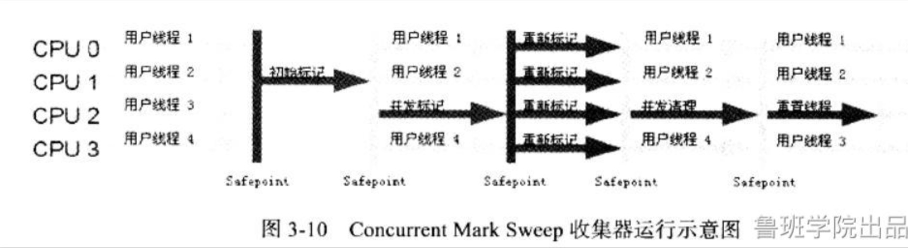
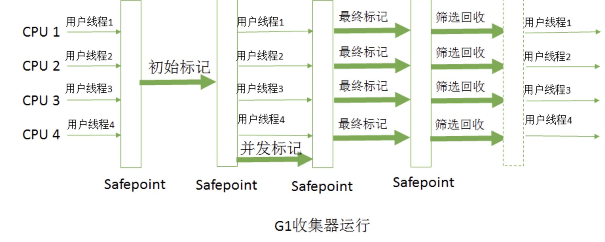

- [1、垃圾判断算法](#1垃圾判断算法)
  - [1.1、引用计数算法](#11引用计数算法)
  - [1.2、可达性分析算法](#12可达性分析算法)
- [2、垃圾回收算法](#2垃圾回收算法)
- [3、垃圾收集器](#3垃圾收集器)
  - [3.1 Serial 收集器](#31-serial-收集器)
  - [3.2 ParNew 收集器](#32-parnew-收集器)
  - [3.3 Parallel 收集器](#33-parallel-收集器)
  - [3.4 Serial Old 收集器](#34-serial-old-收集器)
  - [3.5 Parallel Old 收集器](#35-parallel-old-收集器)
  - [3.6 CMS 收集器](#36-cms-收集器)
  - [3.7 G1 收集器](#37-g1-收集器)
  - [3.8 GC 日志](#38-gc-日志)
- [4、三色标记与读写屏障](#4三色标记与读写屏障)
  - [4.1、为什么要有三色标记？](#41为什么要有三色标记)
  - [4.2 三色标记](#42-三色标记)
    - [4.2.1 多标](#421-多标)
    - [4.2.2 少标](#422-少标)
    - [4.2.3 漏标](#423-漏标)
- [5.记忆集和卡表](#5记忆集和卡表)
    - [5.1、记忆集](#51记忆集)
    - [5.2、卡表](#52卡表)
# 1、垃圾判断算法
即判断JVM中的所有对象，哪些对象是存活的，哪些对象可回收的算法。

## 1.1、引用计数算法
***
每多一个其他对象引用，计数+1，当引用失效时，计数-1，如果计数=0，表示没有其他对象引用，就可以被回收。最简单的垃圾判断算法，无法解决循环依赖问题。
## 1.2、可达性分析算法
***
通过一系列被称为“GC Roots”的根对象作为起始节点集，从这些节点开始，根据引用关系链向下搜索，如果某个对象无法被搜索到，则说明该对象无引用执行，可回收。相反，则对象处于存活状态，不可回收。
***
哪些对象可以作为GC Root呢？
- 所有Java线程当前活跃的栈帧里指向GC堆里的对象的引用；换句话说，当前所有正在被调用的方法的引用类型的参数/局部变量/临时值。
- VM的一些静态数据结构里指向GC堆里的对象的引用，例如说HotSpot VM里的Universe里有很多这样的引用。
- JNI handles，包括global handles和local handles
- （看情况）所有当前被加载的Java类
- （看情况）Java类的引用类型静态变量
- （看情况）Java类的运行时常量池里的引用类型常量（String或Class类型）
- （看情况）String常量池（StringTable）里的引用

# 2、垃圾回收算法
- 1、标记-清除算法
- 2、标记-整理算法
- 3、分代-复制算法

# 3、垃圾收集器
目前JVM中的收集器有九种，了解5个，详解2个。因为并发、分区管理式的收集器才是未来的趋势。

STW：stop the world 暂停所有用户线程
-   串行

    用户线程STW，一个GC线程运行（Serial收集器）
-   并行

    用户线程STW，多个GC线程运行（ParNew收集器）
-   并发

    用户线程和GC线程同时运行（CMS、G1、ZGC··）
## 3.1 Serial 收集器
***
串行垃圾收集器，即GC线程与用户线程先后运行，即GC时需要STW（暂停所有用户线程），直至GC结束才恢复用户线程的运行

专注于收集年轻代，底层是复制算法

相关参数：-XX:+UseSerialGC
## 3.2 ParNew 收集器
***
Serial收集器的多线程版本。唯一能与CMS收集器搭配使用的新生代收集器。

相关参数：
  - -XX:+UseConcMarkSweepGC：指定使用CMS后，会默认使用ParNew作为新生代收集器
  - -XX:+UseParNewGC：强制指定使用ParNew
  - -XX:ParallelGCThreads：指定垃圾收集的线程数量，ParNew默认开启的收集线程与CPU的数量相同
## 3.3 Parallel 收集器
***
关注吞吐量的收集器

吞吐量 = 运行用户代码时间 / (运行用户代码时间+垃圾收集时间)
## 3.4 Serial Old 收集器
***
Serial收集器的老年代版本。基于标记-整理算法实现，

有两个用途：
- 1、与Serial收集器、Parallel收集器搭配使用
- 2、作为CMS收集器的后备方案
## 3.5 Parallel Old 收集器
***
Parallel收集器的老年代版本。基于标记-整理算法实现。
## 3.6 CMS 收集器
***

聚焦低延迟。基于标记-清除算法实现。

由于CMS收集器是并发收集器，即在运行阶段用户线程依然在运行，会产生对象，所以CMS收集器不能等到老年代满了才触发，而是要提前触发，这个阈值是92%。这个阈值可以通过参数-XX:CMSInitiatingOccupancyFraction设置

相关参数：
- -XX：+UseConcMarkSweepGC：手动开启CMS收集器
- -XX:+CMSIncrementalMode：设置为增量模式
- -XX:CMSFullGCsBeforeCompaction：设定进行多少次CMS垃圾回收后，进行一次内存压缩
- -XX:+CMSClassUnloadingEnabled：允许对类元数据进行回收
- -XX:UseCMSInitiatingOccupancyOnly：表示只在到达阀值的时候，才进行CMS回收
- -XX:CMSInitiatingOccupancyFraction：设置CMS收集器在老年代空间被使用多少后触发
- -XX:+UseCMSCompactAtFullCollection：设置CMS收集器在完成垃圾收集后是否要进行一次内存碎片的整理

**CMS缺点：**
- 1、运行期间会与用户线程抢夺CPU资源。当然，这是所有并发收集器的缺点
- 2、无法处理浮动垃圾（标记结束后创建的对象）
- 3、内存碎片
## 3.7 G1 收集器
***

G1收集器与之前的所有收集器都不一样，它将堆分成了一个一个Region，这些Region用的时候才被赋予角色：Eden、from、to、humongous。一个region只能是一个角色。

一个对象的大小超过region的一半则被认定为大对象，会用N个连续的region来存储，也就是humongous。

G1能管理的最大堆空间是 4 - 64G （64G指针压缩就没法用了）

2048个region * 每个region大小(2 - 32M，可以设置)

相关参数：
- -XX:G1HeapRegionSize：设置region的大小
- -XX:MaxGCPauseMillis：设置GC回收时允许的最大停顿时间（默认200ms）
- -XX:+UseG1GC：开启g1
- -XX:ConcGCThreads：设置并发标记、并发整理的gc线程数
- -XX:ParallelGCThreads：STW期间并行执行的gc线程数

**G1收集器缺点：**
- 1、需要10%-20%的内存来存储G1收集器运行需要的数据，如不cset、rset、卡表等
- 2、运行期间会与用户线程抢夺CPU资源。当然，这是所有并发收集器的缺点

**查看默认收集器：java -XX:+PrintFlagsFinal -version | grep GC**

## 3.8 GC 日志

相关参数:
-   -XX:+PrintGC 输出GC日志
-   -XX:+PrintGCDetails 输出GC的详细日志
-   -XX:+PrintGCTimeStamps 输出GC的时间戳（以基准时间的形式）
-   -XX:+PrintGCDateStamps 输出GC的时间戳（以日期的形式，如 2013-05-04T21:53:59.234+0800）
-   -XX:+PrintHeapAtGC 在进行GC的前后打印出堆的信息
-   -Xloggc:../logs/gc.log 日志文件的输出路径

[Full GC (Metadata GC Threshold) [PSYoungGen: 1133K->0K(46592K)] [ParOldGen: 8K->1013K(76800K)] 1141K->1013K(123392K), [Metaspace: 4061K->4061K(1056768K)], 0.0815840 secs] [Times: user=0.13 sys=0.00, real=0.08 secs] 

- 1、gc类型：GC、Full GC
- 2、gc原因：Metadata GC Threshold、Last ditch collection……
- 3、gc前内存数据
- 4、gc后内存数据
- 5、花费的时间：用户态、内核态、实际用时

# 4、三色标记与读写屏障
## 4.1、为什么要有三色标记？
为了解决并发收集问题。并发标记会有问题：多标，少标，漏标。垃圾收集器是如何解决这个问题的呢：三色标记+读写屏障。
## 4.2 三色标记
把遍历对象过程中遇到的对象，按照“是否访问过”这个条件标记成三种颜色：
- 白色：尚未访问过。（会被GC掉）
- 黑色：本对象已访问过，而且本对象 引用到 的其他对象 也全部访问过了。
- 灰色：本对象已访问过，但是本对象 引用到 的其他对象 尚未全部访问完。全部访问后，会转换为黑色。
***
  - 初始标记：只标记GC Roots直接关联的对象对象（此时GC Roots对象为黑色）
  - 并发标记：标记与GC Roots关联的对象的对象（其他对象也变为黑色）
  - 重新标记：
### 4.2.1 多标
    GC线程已经标记了B，此时用户代码中A断开了对B的引用，但此时B已经被标记成了灰色，本轮GC不会被回收，这就是所谓的多标，多标的对象即成为浮动垃圾，躲过了本次GC。

    多标对程序逻辑是没有影响的，唯一的影响是该回收的对象躲过了一次GC，造成了些许的内存浪费。
### 4.2.2 少标
    并发标记开始后创建的对象，都视为黑色，本轮GC不清除。

    这里面有的对象用完就变成垃圾了，就可以销毁了，这部分对象即少标环境中的浮动垃圾。
### 4.2.3 漏标
    漏标是如何产生的呢？GC把B标记完，准备标记B引用的对象，这时用户线程执行代码，代码中断开了B对D的引用，改为A对D的引用。但是A已经被标记成黑色，不会再次扫描A，而D还是白色，执行垃圾回收逻辑的时候D会被回收，程序就会出错了。

- 如何解决漏标问题？
  - 1、读屏障 + 重新标记

    在建立A对D的引用时将D作为白色或灰色对象记录下来，并发标记结束后STW，然后重新标记由D类似的对象组成的集合。重新标记环节一定要STW，不然标记就没完没了了。
  - 2、写屏障 + 增量更新（IU）

    这种方式解决的是条件二，即通过写屏障记录下更新，具体做法如下：对象A对D的引用关系建立时，将D加入带扫描的集合中等待扫描
  - 3、写屏障 + 原始快照（SATB）

    这种方式解决的是条件一，带来的结果是依然能够标记到D，具体做法如下：对象B的引用关系变动的时候，即给B对象中的某个属性赋值时，将之前的引用关系记录下来。标记的时候，扫描旧的对象图，这个旧的对象图即原始快照。
  - 4、实际应用

    CMS：写屏障 + 增量更新

    G1：写屏障 + SATB
# 5.记忆集和卡表
### 5.1、记忆集
跨代引用
- 新生代引用老年代

    发生young gc 新生代对象被回收，程序不会有问题
- 老年代引用新生代

    发生young gc 新生代对象被回收，老年代访问不到新生代会报错
### 5.2、卡表
记忆集是原理，卡表是实现

卡表中有2048个卡页，一个卡页对应一个region，一个卡页是512B

