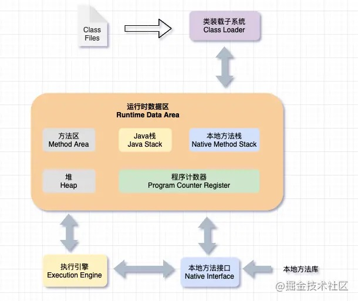
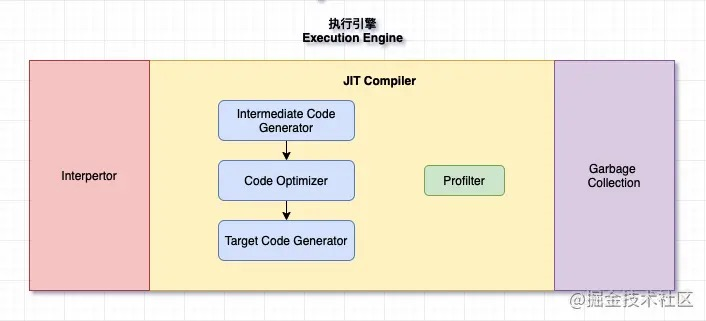

- [1、执行引擎概述](#1执行引擎概述)
- [1.1 执行引擎的工作过程](#11-执行引擎的工作过程)
- [1.2 解释器](#12-解释器)
- [2、JIT编译器](#2jit编译器)
- [3、三种运行模式](#3三种运行模式)
- [4、即时编译器](#4即时编译器)
- [5、逃逸分析](#5逃逸分析)

# 1、执行引擎概述

- 执行引擎是Java虚拟机核心的组成部分之一
- “虚拟机”是一个相对于“物理机”的概念，这两种机器都有代码执行能力，其区别是物理机的执行引擎是直接建立在处理器、缓存、指令集和操作系统层面上面的，而虚拟机的执行引擎则是由软件自行实现的，因此可以不受物理条件制约地定制指令集与执行引擎的结构体系，能够执行那些不被硬件直接支持的指令集格式
- JVM的主要任务是负责装载字节码到其内部，但字节码并不能够直接运行在操作系统之上，因为字节码指令并非等价于本地机器指令，它内部包含的仅仅是一些能够被JVM所识别的字节码指令、符号表，以及其他辅助信息
- 如果要让一个Java程序运行起来，执行引擎的任务就是将字节码指令解释/编译为对应平台上的本地机器指令才可以。简单来说，JVM中的执行引擎充当了将高级语言翻译为机器语言的译者
- Java程序编译成字节码，这个过程称为前端编译，而执行引擎将字节码编译成本地机器指令，这个过程称为后端编译
# 1.1 执行引擎的工作过程
- 执行引擎在执行过程中需要什么样的字节码指令完全依赖于PC寄存器
- 每当执行完一项指令操作后，PC寄存器就会更新下一条需要被执行的指令地址
- 当然方法在执行的过程中，执行引擎有可能会通过存储在局部变量表中的对象引用准确定位到存储在Java堆区中的对象实例信息，以及通过对象头中的元数据指针（即类型指针）定位到目标对象的类型信息（即定位到方法区）
- 从外观上来看，所有的Java虚拟机的执行引擎输入、输出都是一致的：输入的是字节码二进制流，处理过程是字节码解析执行的等效过程，输出的是执行结果
# 1.2 解释器
- 字节码解释器
  - java字节码 -> c++代码 ->硬编码
  - 字节码解释器是解释执行，跟即时编译器无关。
- 模板解释器
  - java字节码 -> 硬编码
  - 原理：
    - 申请一块可读可写可执行的内存（Mac无法使用JIT，因为无法申请这样的内存， mmap函数）
    - 将处理NEW字节码的硬编码拿过来（llbd 解析可执行文件）
    - 将处理NEW字节码的硬编码写入之前申请的内存
    - 申请一个函数指针，用这个函数指针指向这块内存
    - 直接通过函数指针调用
# 2、JIT编译器
- 第一种是将源代码编译成字节码文件，然后在运行时通过解释器将字节码文件转为机器码执行
- 第二种是编译执行（直接编译成机器码）。现代虚拟机为了提高执行效率，会使用即时编译技术（JIT, Just In Time)将方法编译成机器码后再执行
- 热点代码缓存（方法区，可调优，但是没必要）
- java -client -XX:+PrintFlagsFinal -version | grep CodeCache
  - InitialCodeCacheSize 初始化大小
  - ReservedCodeCacheSize 最大大小
# 3、三种运行模式
- -Xint 纯字节码解释器
- -Xcomp 纯模板解释器
- -Xmixed 字节码+模板
# 4、即时编译器
- C1编译器是client模式下的即时编译器
- C2编译器是Server模式下的即时编译器
- 混合编译（初期C1，后续变为C2）
  - 即时编译的组小单位不是一个函数，而是代码块（for、while代码块）
  - java -client -XX:+PrintFlagsFinal -version | grep CompileThreshold
    - Client编译器模式下，N的默认值是1500
    - Server编译器模式下，N的默认值是10000
# 5、逃逸分析
简单来说，局部变量就是不逃逸，如果作为值返回或者是成员变量，就有可能发生逃逸。JVM基于逃逸分析有3种优化方式：
- 栈上分配
  - TLAB，对象直接分配在虚拟机栈，可以用HSDB验证。
  - 参数：-XX:DoEscapeAnalysis ，默认开启
  - 在方法里面生成100万个对象，用HSDB查看是否有100万个来判断是否有栈上分配（不发生gc的情况）
- 标量替换
  - 会将某些不会逃逸的局部变量替换为常量
- 锁消除
  - sync关键字有讲，如果不发生逃逸，会取消加锁。

