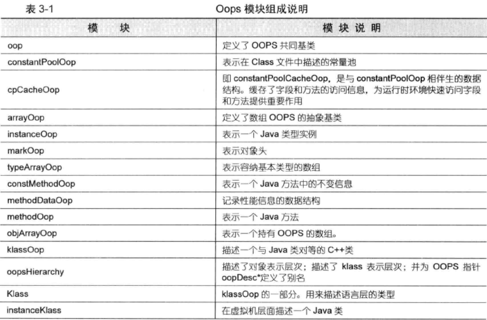
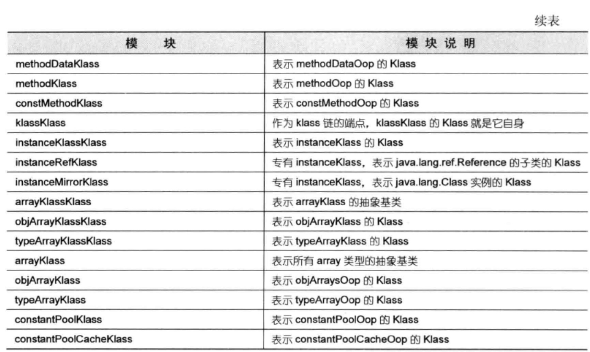
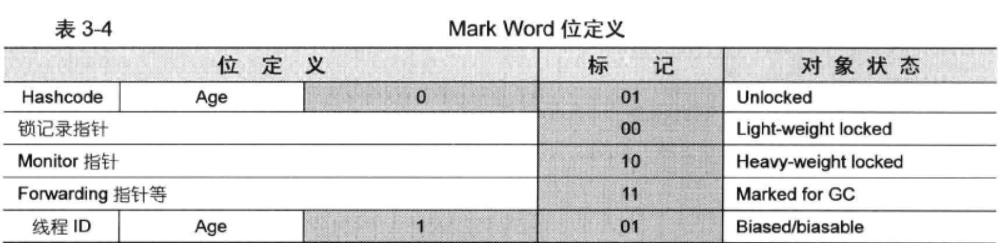
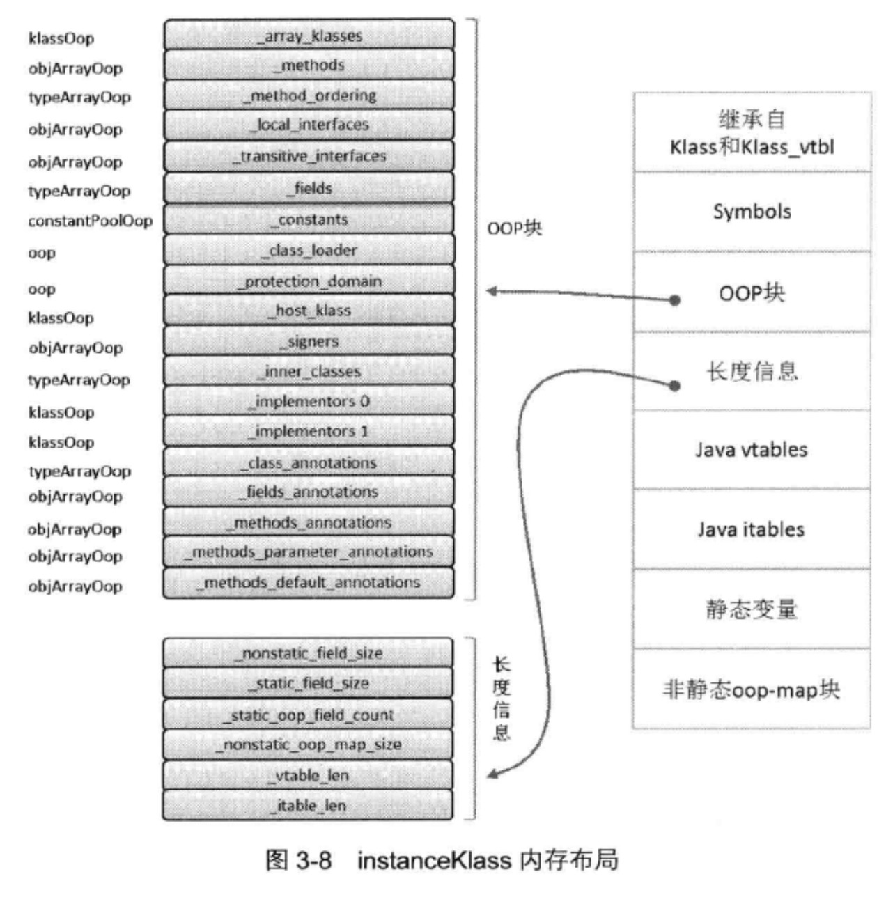
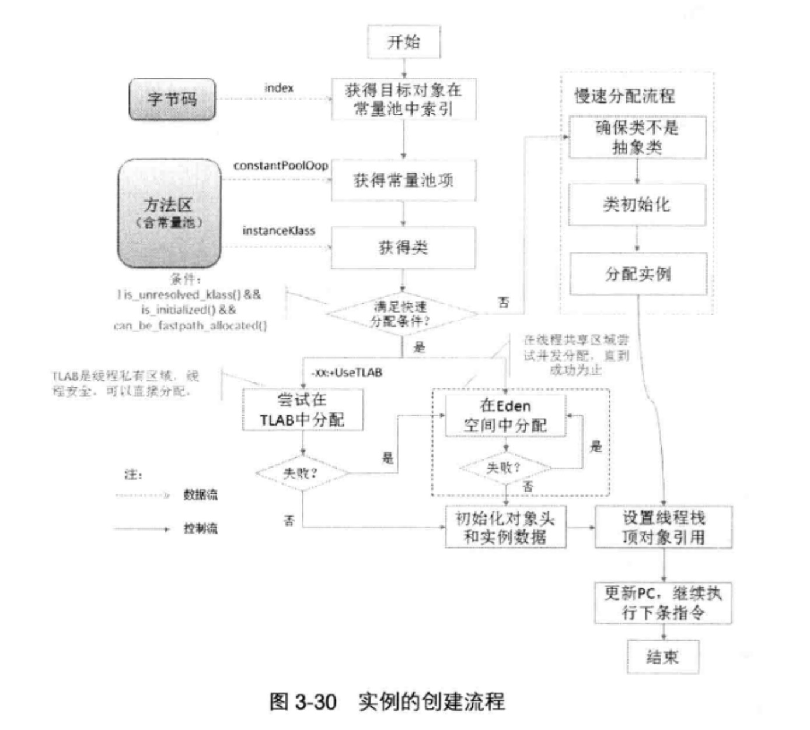

- [1、对象表示机制](#1对象表示机制)
  - [1.1、OOP - Klass 二分模型](#11oop---klass-二分模型)
  - [1.2、Oops模块](#12oops模块)
  - [1.3、OOP框架与对象访问机制](#13oop框架与对象访问机制)
  - [1.4、Klass 与 instanceKlass](#14klass-与-instanceklass)
- [2、类加载的过程](#2类加载的过程)

# 1、对象表示机制
## 1.1、OOP - Klass 二分模型
设计一个面向对象系统，需要支持封装、继承、多态特性
- OOP ： 普通对象指针，用来描述对象实例信息
- Klass ： Java类对应的C++类，用来描述Java类

    Klass向JVM提供2个功能：
    -   实现语言层面的Java
    -   实现Java对象的分发功能（多态？）
## 1.2、Oops模块

## 1.3、OOP框架与对象访问机制
在Java中创建一个类，JVM内部也会创建一个OOP对象用来表示Java对象。OOPS类的共同基类型为oopDesc。
-   instanceOopDesc 表示类实例
-   arrayOopDesc 表示数组

对象在内存中布局分为2部分：
-   instanceOopDesc（对象头）

        1、Mark Word：存储对象运行时记录信息，例如哈希码、GC分代年龄、锁标志、线程持有的锁、偏向线程id、偏向时间戳等，占用内存与虚拟机位一致
        32位32 64位64，允许压缩
        2、元数据指针（Klass Pointer）：指向描述类型Klass对象的指针。存储了实例对象的元数据，虚拟机运行时频繁使用这个指针定位到位于方法区的类信息

-   实例数据

OOP框架采用指针压缩来优化内存 -XX:+/-UseCompressedOops 开启或关闭+/-

## 1.4、Klass 与 instanceKlass
-   核心数据结构 Klass

        Klass数据结构定义了所有Klass类型共享的结构和行为：描述类型自身的布局，刻画出与其他类之间的关系（父类、子类、兄弟类等）
        Klass对象的成员变量：
            _layout_helper：
                1、如果是非数组对象，这个值就是类生成的对象大小
                2、如果是数组对象，负数
                3、==0
            _super表示父类，_subklass指向第一个子类（没有则为null），JVM通过_subklass -> next_sibling()找到下一个子类
-   核心数据结构 instanceKlass

        JVM运行时，需要一种用来标识Java内部类型的机制。HotSpot解决方案是为每一个加载的类创建一个instanceKlass对象，用来在JVM层表示Java类，这个类的成员变量在解析阶段完成赋值。
    
-   实例数据的存储顺序

        除了与在Java类中定义的顺序有关，还与类型大小有关，long/double , int, char/short, byte/boolean相同大小分配一起
# 2、类加载的过程
-   初始化类加载器

        类加载器初始化时，首先初始化与类加载器相关的一些PerfData计数器，加载本地库libverify和libjava，接着加载libzip库
-   加载

        ClassFileParser利用ClassFileStream从.class文件读取文件流，依次解析：
            1、读取魔数
            2、读取主、次版本号
            3、常量池
            4、访问标识并校验
            5、this类全限定名
            6、获取父类
            7、获取接口
            8、读取并配置字段信息
            9、读取并配置方法信息
            10、计算java vtable和itable大小
            11、创建instanceKlass对象
            12、创建java镜像类instanceMirrorKlass并初始化静态域
            13、通知系统类已经加载
-   验证

        方法访问控制、参数和静态类型检查、堆栈是否滥用、验证局部变量表····
-   准备

        赋初值 int = 0 long = 0L
		final修饰的会给属性添加ConstantValue， 直接赋值，没有赋初值一说
-   解析

        将常量池中的4类符号引用转为直接引用，即真实的内存地址：
            类、接口、字段、方法（做了优化，添加constantPoolCache）
-   初始化

    触发初始化的几种操作：
    - JVM指令：new、getstatic、putstatic、invokestatic
    - 初次调用java.lang.invoke.MethodHandle实例时，返回结果为REF_getStatic、REF_putStatic、REF_invokeStatic
    - 反射
    - 初始化子类时一定会初始化父类
    - 类被用作JVM初始化类
  
    类初始化阶段，JVM底层会加锁，加锁对象为ObjectLocker，C++的一个对象
    

