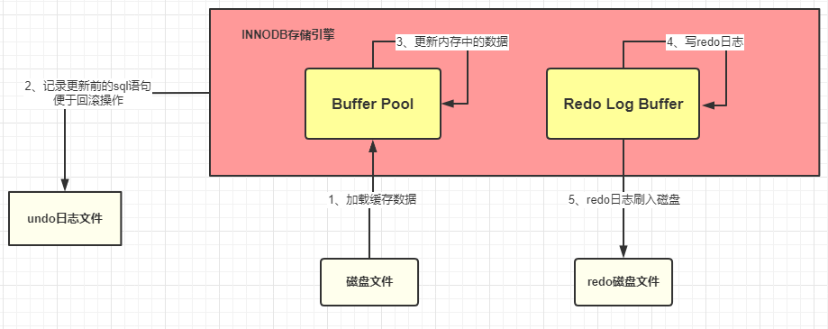

# 1、MySQL驱动
java 系统在通过 MySQL 驱动和 MySQL 数据库连接的时候是基于 TCP/IP 协议的

MySQL区帮我们建立连接（连接池）
# 2、SQL接口
MySQL 中处理请求的线程在获取到请求以后获取 SQL 语句去交给 SQL 接口去处理。
# 3、查询解析器

# 4、查询优化器
- IO 成本: 即从磁盘把数据加载到内存的成本，默认情况下，读取数据页的 IO 成本是 1，MySQL 是以页的形式读取数据的，即当用到某个数据时，并不会只读取这个数据，而会把这个数据相邻的数据也一起读到内存中，这就是有名的程序局部性原理，所以 MySQL 每次会读取一整页，一页的成本就是 1。所以 IO 的成本主要和页的大小有关。
- CPU 成本：将数据读入内存后，还要检测数据是否满足条件和排序等 CPU 操作的成本，显然它与行数有关，默认情况下，检测记录的成本是 0.2。

优化器执行选出最优索引等步骤后，会去调用存储引擎接口，开始去执行被 MySQL 解析过和优化过的 SQL 语句

# 5、执行器
执行器是一个非常重要的组件，因为前面那些组件的操作最终必须通过执行器去调用存储引擎接口才能被执行。执行器最终最根据一系列的执行计划去调用存储引擎的接口去完成 SQL 的执行

# 6、存储引擎
查询优化器会调用存储引擎的接口，去执行 SQL，也就是说真正执行 SQL 的动作是在存储引擎中完成的。数据是被存放在内存或者是磁盘中的。

**缓冲池 Buffer Pool**
- innodb 存储引擎会在缓冲池中查找 id=1 的这条数据是否存在
- 发现不存在，那么就会去磁盘中加载，并将其存放在缓冲池中
- 该条记录会被加上一个独占锁
# 7、undo 日志文件：记录数据被修改前的样子

# 8、redo 日志文件：记录数据被修改后的样子
redo 日志文件是 InnoDB 特有的，他是存储引擎级别的，不是 MySQL 级别的。

redo 记录的是数据修改之后的值，不管事务是否提交都会记录下来，例如，此时将要做的是update students set stuName='小强' where id=1; 那么这条操作就会被记录到 redo log buffer 中，啥？怎么又出来一个 redo log buffer ,很简单，MySQL 为了提高效率，所以将这些操作都先放在内存中去完成，然后会在某个时机将其持久化到磁盘中。

将  redo Log Buffer 中的数据持久化到磁盘中，就是将 redo log buffer 中的数据写入到 redo log 磁盘文件中，一般情况下，redo log Buffer 数据写入磁盘的策略是立即刷入磁盘

刷磁盘可以通过 innodb_flush_log_at_trx_commit 参数来设置
- 值为 0 表示不刷入磁盘
- 值为 1 表示立即刷入磁盘
- 值为 2 表示先刷到 os cache
- myslq 重启的时候会将 redo 日志恢复到缓冲池中
# 9、bin log 日志文件：记录整个操作过程

bin log 的刷盘是有相关的策略的，策略可以通过sync_bin log来修改，默认为 0，表示先写入 os cache，也就是说在提交事务的时候，数据不会直接到磁盘中，这样如果宕机bin log数据仍然会丢失。所以建议将sync_bin log设置为 1 表示直接将数据写入到磁盘文件中。

刷入 bin log 有以下几种模式：
- STATMENT
  - 基于 SQL 语句的复制(statement-based replication, SBR)，每一条会修改数据的 SQL 语句会记录到 bin log 中
  - 【优点】：不需要记录每一行的变化，减少了 bin log 日志量，节约了 IO , 从而提高了性能
  - 【缺点】：在某些情况下会导致主从数据不一致，比如执行sysdate()、sleep()等
- ROW
  - 基于行的复制(row-based replication, RBR)，不记录每条SQL语句的上下文信息，仅需记录哪条数据被修改了
  - 【优点】：不会出现某些特定情况下的存储过程、或 function、或 trigger 的调用和触发无法被正确复制的问题
  - 【缺点】：会产生大量的日志，尤其是 alter table 的时候会让日志暴涨
- MIXED
  - 基于 STATMENT 和 ROW 两种模式的混合复制( mixed-based replication, MBR )，一般的复制使用 STATEMENT 模式保存 bin log ，对于 STATEMENT 模式无法复制的操作使用 ROW 模式保存 bin log 
  - 其实 MySQL 在提交事务的时候，不仅仅会将 redo log buffer  中的数据写入到redo log 文件中，同时也会将本次修改的数据记录到 bin log文件中，同时会将本次修改的bin log文件名和修改的内容在bin log中的位置记录到redo log中，最后还会在redo log最后写入 commit 标记，这样就表示本次事务被成功的提交了。 
  - 首先可以确定的是，只要redo log最后没有 commit 标记，说明本次的事务一定是失败的。但是数据是没有丢失了，因为已经被记录到redo log的磁盘文件中了。在 MySQL 重启的时候，就会将 redo log 中的数据恢复（加载）到Buffer Pool中。
 

