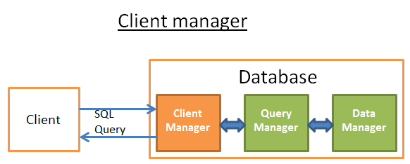

# 1、全局概览 #
数据库一般可以用如下图形来理解
***

## 1.1、核心组件 ##
- 进程管理器（process manager）
    
    很多数据库具备一个需要妥善管理的进程/线程池。再者，为了实现纳秒级操作，一些现代数据库使用自己的线程而不是操作系统线程。
-   网络管理器（network manager）
  
    网路I/O是个大问题，尤其是对于分布式数据库。所以一些数据库具备自己的网络管理器。
-   文件系统管理器（File system manager）
    
    磁盘I/O是数据库的首要瓶颈。具备一个文件系统管理器来完美地处理OS文件系统甚至取代OS文件系统，是非常重要的。
-   内存管理器（memory manager）

    为了避免磁盘I/O带来的性能损失，需要大量的内存。但是如果你要处理大容量内存你需要高效的内存管理器，尤其是你有很多查询同时使用内存的时候。
-   安全管理器（Security Manager）

    用于对用户的验证和授权。
-   客户端管理器（Client manager）

    用于管理客户端连接。
-   ······
## 1.2、工具 ##
-   备份管理器（Backup manager）

    用于保存和恢复数据。
-   恢复管理器（Recovery manager）

    用于崩溃后重启数据库到一个一致状态。
-   监控管理器（Monitor manager）

    用于记录数据库活动信息和提供监控数据库的工具。
-   管理员管理器（Administration manager）

    用于保存元数据（比如表的名称和结构），提供管理数据库、模式、表空间的工具。
-   ···
## 1.3、查询管理器 ##
-   查询解析器（Query parser）

    用于检查查询语句是否合法
-   查询重写器（Query rewriter）

    用于预优化查询
-   查询优化器（Query optimizer）

    用于优化查询
-   查询执行器（Query executor）

    用于编译和执行查询
## 1.4、数据管理器 ##
-   事务管理器（Transaction manager）

    用于处理事务
-   缓存管理器（Cache manager）

    数据被使用之前置于内存，或者数据写入磁盘之前置于内存
-   数据访问管理器（Data access manager）

    访问磁盘中的数据
# 2、数据查询的过程 #

    ## 客户端管理器 ##

    提供一系列API（JDBC、ODBC···）来访问数据库
## 2.1、查询管理器 ##
-   首先解析语句判断是否合法
-   然后重写语句，去除无用部分并加入预优化部分
-   接着被优化以便提升性能，并转换为可执行的代码和数据访问计划
-   编译
-   执行
### 2.1.1、查询解析器 ###

    使用数据库元数据来检查
- 表是否存在
- 字段是否存在
- 对某些字段的函数是否支持（例如不能对int类型进行substring操作）
- ···
- 是否有权限来读取（写入）表
### 2.1.2、查询重写器 ###
-   预优化查询
-   避免不必要的运算
-   帮助优化器找到合理的最佳解决方案
  
    动态规划，贪心算法和启发式算法
### 2.1.3、统计 ###
-   表中的行和页数量
-   表中每个列中的

        唯一值

        数据长度

        数据范围
-   表的索引信息

这些统计信息会帮助优化器估计查询所需的磁盘 I/O、CPU、和内存使用
### 2.1.4、查询优化器 ###
-   索引
-   存取路径
    -   全扫描
    -   范围扫描
    -   唯一扫描
-  连接运算符
### 2.1.5、查询执行器 ###

    在这个阶段，我们有了一个优化的执行计划，再编译为可执行代码。然后，如果有足够资源（内存，CPU），查询执行器就会执行它。计划中的操作符 (JOIN, SORT BY …) 可以顺序或并行执行，这取决于执行器。为了获得和写入数据，查询执行器与数据管理器交互，本文下一部分来讨论数据管理器。
## 2.2 数据管理器 ##
-   缓存管理器
-   事务管理器
-   并发控制
-   锁管理器
-   日志管理器

