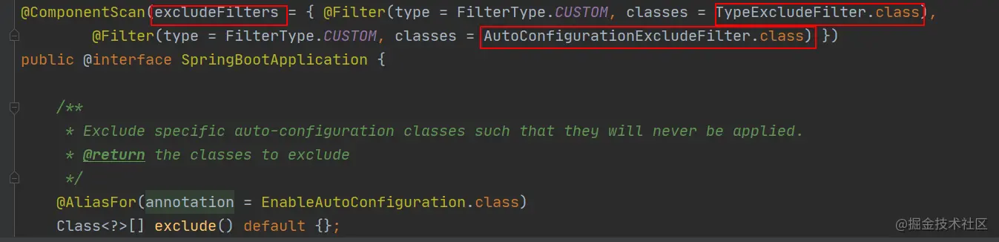
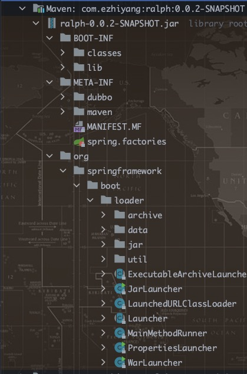

- [1、什么是SpringBoot自动装配](#1什么是springboot自动装配)
- [2、SpringBoot 是如何实现自动装配的？](#2springboot-是如何实现自动装配的)
- [3、Java -jar xxxx.jar运行原理](#3java--jar-xxxxjar运行原理)
- [4、总结](#4总结)

# 1、什么是SpringBoot自动装配

我们现在提到自动装配的时候，一般会和 Spring Boot 联系在一起。但是，实际上 Spring Framework 早就实现了这个功能。Spring Boot 只是在其基础上，通过 SPI 的方式，做了进一步优化。

    SpringBoot 定义了一套接口规范，这套规范规定：SpringBoot 在启动时会扫描外部引用 jar 包中的META-INF/spring.factories文件，将文件中配置的类型信息加载到 Spring 容器（此处涉及到 JVM 类加载机制与 Spring 的容器知识），并执行类中定义的各种操作。对于外部 jar 来说，只需要按照 SpringBoot 定义的标准，就能将自己的功能装置进 SpringBoot。
# 2、SpringBoot 是如何实现自动装配的？

        @Target({ElementType.TYPE})
        @Retention(RetentionPolicy.RUNTIME)
        @Documented
        @Inherited
        @SpringBootConfiguration
        @ComponentScan
        @EnableAutoConfiguration
        public @interface SpringBootApplication {

        }

- @EnableAutoConfiguration：启用 SpringBoot 的自动配置机制
- @Configuration：允许在上下文中注册额外的 bean 或导入其他配置类
- @ComponentScan： 扫描被@Component (@Service,@Controller)注解的 bean，注解默认会扫描启动类所在的包下所有的类 ，可以自定义不扫描某些 bean。如下图所示，容器中将排除TypeExcludeFilter和AutoConfigurationExcludeFilter。

    

- @EnableAutoConfiguration:实现自动装配的核心注解

        @Target({ElementType.TYPE})
        @Retention(RetentionPolicy.RUNTIME)
        @Documented
        @Inherited
        @AutoConfigurationPackage //作用：将main包下的所欲组件注册到容器中
        @Import({AutoConfigurationImportSelector.class}) //加载自动装配类 xxxAutoconfiguration
        public @interface EnableAutoConfiguration {
            String ENABLED_OVERRIDE_PROPERTY = "spring.boot.enableautoconfiguration";

            Class<?>[] exclude() default {};

            String[] excludeName() default {};
        }

    EnableAutoConfiguration 只是一个简单地注解，自动装配核心功能的实现实际是通过 AutoConfigurationImportSelector类。

    AutoConfigurationImportSelector实现了DeferredImportSelector类，重写getImportGroup，返回自定义的对象，会去调用这个对象的process方法

        public Class<? extends Group> getImportGroup() {
            return AutoConfigurationImportSelector.AutoConfigurationGroup.class;
         }

         public void process(AnnotationMetadata annotationMetadata, DeferredImportSelector deferredImportSelector) {
            Assert.state(deferredImportSelector instanceof AutoConfigurationImportSelector, () -> {
                return String.format("Only %s implementations are supported, got %s", AutoConfigurationImportSelector.class.getSimpleName(), deferredImportSelector.getClass().getName());
            });
            //获取所有的自动配置类
            AutoConfigurationImportSelector.AutoConfigurationEntry autoConfigurationEntry = ((AutoConfigurationImportSelector)deferredImportSelector).getAutoConfigurationEntry(this.getAutoConfigurationMetadata(), annotationMetadata);
            this.autoConfigurationEntries.add(autoConfigurationEntry);
            Iterator var4 = autoConfigurationEntry.getConfigurations().iterator();

            while(var4.hasNext()) {
                String importClassName = (String)var4.next();
                this.entries.putIfAbsent(importClassName, annotationMetadata);
            }
        }

        protected AutoConfigurationImportSelector.AutoConfigurationEntry getAutoConfigurationEntry(AutoConfigurationMetadata autoConfigurationMetadata, AnnotationMetadata annotationMetadata) {
        if (!this.isEnabled(annotationMetadata)) {
            return EMPTY_ENTRY;
        } else {
            //获取所有带EnableAutoConfiguration注解的类的名称
            AnnotationAttributes attributes = this.getAttributes(annotationMetadata);

            //SpringFactoriesLoader.loadFactoryNames去加载所有META-INF/spring.factories key为EnableAutoConfiguration
            List<String> configurations = this.getCandidateConfigurations(annotationMetadata, attributes);

            //排除掉重复的
            configurations = this.removeDuplicates(configurations);

            //获取带有exclude 或者 excludeName
            Set<String> exclusions = this.getExclusions(annotationMetadata, attributes);

            this.checkExcludedClasses(configurations, exclusions);
            configurations.removeAll(exclusions);

            //过滤掉实现了AutoConfigurationImportFilter类的（OnBeanCondition  OnClassCondition OnWebApplicationCondition）， 没有这些注解支持的类
            configurations = this.filter(configurations, autoConfigurationMetadata);

            this.fireAutoConfigurationImportEvents(configurations, exclusions);
            return new AutoConfigurationImportSelector.AutoConfigurationEntry(configurations, exclusions);
        }
    
    最终将生成的这些完整类路径的自动配置类放入BeanDefinitionMap中，进行后续的spring生命周期
# 3、Java -jar xxxx.jar运行原理
依赖于pom.xml中：

        <plugin>
                <groupId>org.springframework.boot</groupId>
                <artifactId>spring-boot-maven-plugin</artifactId>
        <plugin>
打包完jar包结构：

由JarLauncher去加载META-INF中MANIFEST.MF的文件，MANIFEST.MF内容：

        Manifest-Version: 1.0
        Implementation-Title: ralph
        Implementation-Version: 0.0.2-SNAPSHOT
        Start-Class: com.ezhiyang.ralph.RalphApplication
        Spring-Boot-Classes: BOOT-INF/classes/
        Spring-Boot-Lib: BOOT-INF/lib/
        Build-Jdk-Spec: 1.8
        Spring-Boot-Version: 2.2.5.RELEASE
        Created-By: Maven Archiver 3.4.0
        Main-Class: org.springframework.boot.loader.JarLauncher
运行Start-Class

# 4、总结

    SpringBoot应用启动的时候，会使用@EnableAutoConfigutaion注解 ---> @Import导入一个AutoConfigurationImportSelector，该类实现了DeferredImportSelector和一些感知类型接口，重写了DeferredImportSelector中的selectImports方法和getImportGroup方法(    返回AutoConfigurationGroup类，回去调用AutoConfigurationGroup的process方法来，调用getAutoConfigurationEntry获取自动配置类并放入缓存中) ， getAutoConfigurationEntry方法主要做了一下几件事情：
        1、通过SpringFactoriesLoader.loadFactoryNames去加载所有META-INF/spring.factories key为EnableAutoConfiguration的类
        
        2、移除掉重复的类（将list放入set）

        3、获取需要排除的类（exclude 、  excludeName）

        4、移除掉需要排除的类

        5、过滤一些实现了AutoConfigurationImportFilter类（OnBeanCondition  OnClassCondition OnWebApplicationCondition）， 没有这些注解支持的类）

        6、获取实现了AutoConfigurationImportListener的监听器去执行事件，设置setBeanClassLoader、 setBeanFactory、 setEnvironment、  setResourceLoader
    最终将这些类放入BeanDefinitionMap中，由Spring去进行实例化
