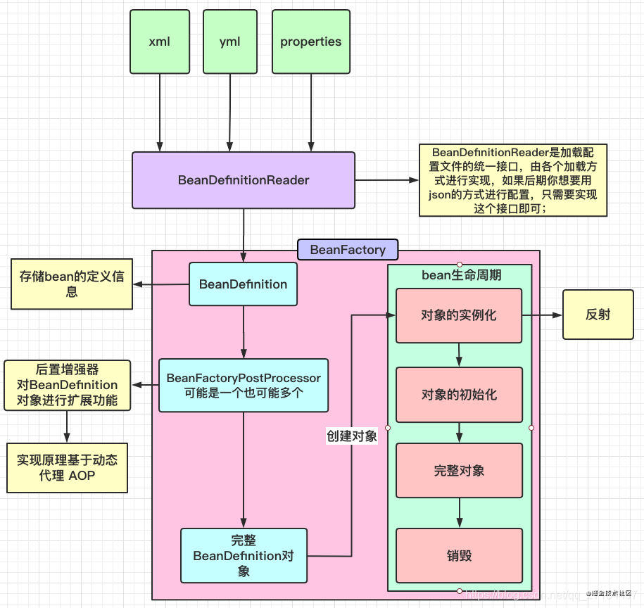

- [1、IOC容器加载过程](#1ioc容器加载过程)
  - [1.1、this()构造函数](#11this构造函数)
  - [1.2、register（annotatedClasses）：注册成bean定义，BeanDefinitionMap](#12registerannotatedclasses注册成bean定义beandefinitionmap)
  - [1.3、refresh（）：刷新IOC容器接口，也就是SpringBean的生命周期](#13refresh刷新ioc容器接口也就是springbean的生命周期)
- [2、SpringBean的生命周期](#2springbean的生命周期)
- [2.1 准备刷新上下文环境](#21-准备刷新上下文环境)
- [2.2 获取告诉子类初始化bean工厂 不同工厂不同实现](#22-获取告诉子类初始化bean工厂-不同工厂不同实现)
- [2.3 对bean工厂进行属性填充](#23-对bean工厂进行属性填充)
- [2.4 留个子类实现postProcessBeanFactory(beanFactory)](#24-留个子类实现postprocessbeanfactorybeanfactory)
- [2.5 调用bean工厂的后置处理器invokeBeanFactoryPostProcessors(beanFactory)](#25-调用bean工厂的后置处理器invokebeanfactorypostprocessorsbeanfactory)
- [2.6 注册我们自定义的bean后置处理器registerBeanPostProcessors(beanFactory)](#26-注册我们自定义的bean后置处理器registerbeanpostprocessorsbeanfactory)
- [2.7 初始化国际资源处理器initMessageSource](#27-初始化国际资源处理器initmessagesource)
- [2.8 创建事件多播器initApplicationEventMuticaster()](#28-创建事件多播器initapplicationeventmuticaster)
- [2.9 SringBoot从这里启动 onRefresh()](#29-sringboot从这里启动-onrefresh)
- [2.10 事件监听器注册到多播器 registerListeners()](#210-事件监听器注册到多播器-registerlisteners)
- [2.11 finishBeanFactoryInitialization(beanFactory) 实例化剩余单例bean](#211-finishbeanfactoryinitializationbeanfactory-实例化剩余单例bean)
- [2.12 finishRefresh() 发布容器刷新时间，SpringCloud从这里启动](#212-finishrefresh-发布容器刷新时间springcloud从这里启动)
- [3、ApplicationContext和BeanFactory有什么区别](#3applicationcontext和beanfactory有什么区别)
- [4、Spring中的事务如何实现的](#4spring中的事务如何实现的)
- [5、@Transaction失效的几种方式](#5transaction失效的几种方式)
- [6、Spring中的设计模式](#6spring中的设计模式)
- [7、SpringMVC执行流程](#7springmvc执行流程)
- [8、BeanFactory和FactoryBean有什么区别](#8beanfactory和factorybean有什么区别)
# 1、IOC容器加载过程

## 1.1、this()构造函数
读取Bean工厂，在父类GenericApplicationContext，beanFactory = new DefaultListableBeanFactory，这个类实现了很多工厂，拥有了很多父工厂的能力。AnnotationConfigApplicationContext中创建了BeanDefinitionReader，创建了很多内置bean定义，用来解析实例化过程中的外置bean，扫描bean：ClassPathBeanDefinitionScanner
- 注册BeanFactory
- 注册BeanDefinitionReader
- 注册BeanDefinitionScanner，可以手动context.scan（）进行扫描
## 1.2、register（annotatedClasses）：注册成bean定义，BeanDefinitionMap
## 1.3、refresh（）：刷新IOC容器接口，也就是SpringBean的生命周期
# 2、SpringBean的生命周期
# 2.1 准备刷新上下文环境
# 2.2 获取告诉子类初始化bean工厂 不同工厂不同实现
# 2.3 对bean工厂进行属性填充
# 2.4 留个子类实现postProcessBeanFactory(beanFactory)
# 2.5 调用bean工厂的后置处理器invokeBeanFactoryPostProcessors(beanFactory)
# 2.6 注册我们自定义的bean后置处理器registerBeanPostProcessors(beanFactory)
# 2.7 初始化国际资源处理器initMessageSource
# 2.8 创建事件多播器initApplicationEventMuticaster()
# 2.9 SringBoot从这里启动 onRefresh()
# 2.10 事件监听器注册到多播器 registerListeners()
# 2.11 finishBeanFactoryInitialization(beanFactory) 实例化剩余单例bean
# 2.12 finishRefresh() 发布容器刷新时间，SpringCloud从这里启动
# 3、ApplicationContext和BeanFactory有什么区别

    BeanFactory是Bean工厂，主要负责创建Bean、维护Bean，而ApplicationContext继承了BeanFactory，所以也拥有这些能力，另外ApplicationContext还继承了很多Aware接口、事件发布接口等，从而ApplicationContext还拥有获取环境变量、国际化、事件发布等等功能。
# 4、Spring中的事务如何实现的
- Spring事务是基于数据库事务和AOP机制来实现的
- 首先对使用了@Transaction注解的Bean，创建代理对象
- 当调用代理对象的方法时，会判断是否有@Transaction注解
- 如果有注解，那么会利用事务管理器创建一个数据库连接
- 修改autocommit属性为false，禁止自动提交。
- 然后执行当前方法，方法中执行sql
- 执行完后，如果没有异常就会提交事务
- 如果出现了异常，会判断是否需要回滚。
- Spring的事务隔离级别就是数据库的事务隔离级别
- Spring事务的传播机制是由自己来实现的，也是Spring中最复杂的
- Spring事务传播机制是基于数据库连接来的，如果传播机制为新开事务，那么就会再建立一条数据库连接
# 5、@Transaction失效的几种方式
- 只有被代理对象调用才会生效，如果是自己new的，那就没效果
- private方法也会失效，因为底层是通过cglib来实现的，子类不能重载父类private方法
- 数据库不支持事务
# 6、Spring中的设计模式
- 工厂模式：BeanFactory、FactoryBean
- 适配器模式：AdvisorAdapter
- 访问者模式：PropertyAccessor接口，属性访问器，用来访问和设置某个对象的属性
- 装饰器模式：BeanWrapper
- 代理模式：AOP
- 观察者模式：事件机制
- 策略模式：InstantationStrategy，根据不同情况实例化
- 模板方法：JdbcTemplate、RestTemplate等等
- 委派模式：BeanDefinitionParserDelegate
- 责任链模式：BeanPostProcessor
# 7、SpringMVC执行流程
- 用户请求发送至前端控制器DispatcherServlet
- DispatcherServlet收到请求后调用HandlerMapping处理器映射器
- 处理器映射器找到具体的处理器（根据XML配置、注解），生成处理器及处理器拦截器一并返回给DispatcherServlet
- DispatcherServlet调用HandlerAdapter处理器适配器
- HandlerAdapter经过适配调用具体的Controller
- Controller执行完后返回ModeAndView
- HandlerAdapter将返回的ModeAndView传给DispatcherServlet
- DispatcherServlet将ModeAndView交给ViewReslover视图解析器
- ViewReslover解析后返回具体的view
- DispatcherServlet根据View进行渲染
- DispatcherServlet响应用户
# 8、BeanFactory和FactoryBean有什么区别
- BeanFactory负责生产bean，就是一个bean工厂
- FactoryBean是一个带有特殊标记的bean，如果我们的类实现了FactoryBean，那么实例化的时候是取得重写FactoryBean的getObject方法返回的bean，可扩展。
  - 如果实现FactoryBean之后也想获得原来的类，可在getBean("&car")方法中加入&符号
