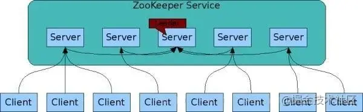

# 1、什么是Zookeeper
- Zookeeper是一个分布式、开元的分布式应用程序协调服务，是Google的Chubby的一个开元的实现，它是集群的管理者，监视着集群中各个节点的状态，根据节点提交的反馈进行下一步合理的操作。最终，将简单易用的接口和性能高效、功能稳定的系统提供给用户。
- Zookeeper一个最常用的场景就是作为服务提供者和消费者的注册中心，服务生产者将自己提供的服务注册到Zookeeper，服务消费者在进行服务调用时先到Zookeeper中查找服务，获取到服务生产者的信息之后在发起调用。
# 2、Zookeeper架构

ZooKeeper 的架构图中我们需要了解和掌握的主要有：
- Zookeeper作为Server和Client，客户端可以连接到整个Zookeeper服务的任意服务器上（除非leaderServer参数被显式设置，leader不允许接受客户端连接）
- 客户端使用并维护一个TCP连接，通过这个连接发送请求、接收响应、获取观察到的事件以及发送信息。如果这个TCP连接中断，客户端将自动尝试连接到别的Zookeeper服务器。客户端第一次连接到Zookeeper服务器时，可以接受这个连接的Zookeeper服务器为这个客户端建立一个会话。当这个客户端连接到别的服务器时，这个回话回呗新的服务器重新建立。
- 上图中的每个Server代表一个安装Zookeeper服务的机器，即是整个提供Zookeeper服务的集群（或者是伪集群）
- 组成Zookeeper服务的服务器必须彼此了解。它们维护一个内存中的状态图像，以及持久存储中的事务日志和快照，只要大多数服务可用，Zookeeper服务就可用。
- Zookeeper启动时，将从实例中选举一个leader，leader负责处理数据更新等操作，一个更新操作成功的标志是当且仅当大多数的Server在内存中成功修改数据。每个Server在内存中存储了一份数据。
- Zookeeper是可以集群复制的，及群众通过Zab协议（Zookeeper Atomic Broadcast）来保证数据一致性。
- Zab协议包含两个阶段：leader election阶段和Atomic Brodcast阶段。
  - 集群中将选举出一个leader，其他的机器则称为follower，所有的写操作都被传送给leader，并通过brodcast将所有的更新告诉给follower。
  - 当leader崩溃或者leader失去大多数的follower时，需要重新选举出一个新的leader，让所有的服务器都恢复到一个正确的状态。
  - 当leader被选举出来，且大多数服务器完成了 和leader的状态同步后，leadder election 的过程就结束了，就将会进入到Atomic brodcast的过程。
  - Atomic Brodcast同步leader和follower之间的信息，保证leader和follower具有形同的系统状态。
# 3、Zookeeer工作原理
- Zookeeper的核心是原子广播，这个机制保证了各个Server之间的同步。实现这个机制的协议叫做Zab协议。
- Zab协议有两种模式，它们 分别是恢复模式（选主）和广播模式（同步）。
- Zab协议 的全称是 **Zookeeper Atomic Broadcast** （Zookeeper原子广播）。Zookeeper 是通过 Zab 协议来保证分布式事务的最终一致性。Zab协议要求每个 Leader 都要经历三个阶段：发现，同步，广播。
- 当服务启动或者在领导者崩溃后，Zab就进入了恢复模式，当领导者被选举出来，且大多数Server完成了和 leader的状态同步以后，恢复模式就结束了。状态同步保证了leader和Server具有相同的系统状态。
- 为了保证事务的顺序一致性，zookeeper采用了递增的事务id号（zxid）来标识事务。所有的提议（proposal）都在被提出的时候加 上了zxid。实现中zxid是一个64位的数字，它高32位是epoch用来标识leader关系是否改变，每次一个leader被选出来，它都会有一 个新的epoch，标识当前属于那个leader的统治时期。第32位用于递增计数。
  - epoch：可以理解为皇帝的年号，当新的皇帝leader产生后，将有一个新的epoch年号。
- 每个Server在工作过程中有三种状态：
  - LOOKING：当前Server不知道leader是谁，正在搜寻。
  - LEADING：当前Server即为选举出来的leader。
  - FOLLOWING：leader已经选举出来，当前Server与之同步。
# 4、Zookeeper设计原理

