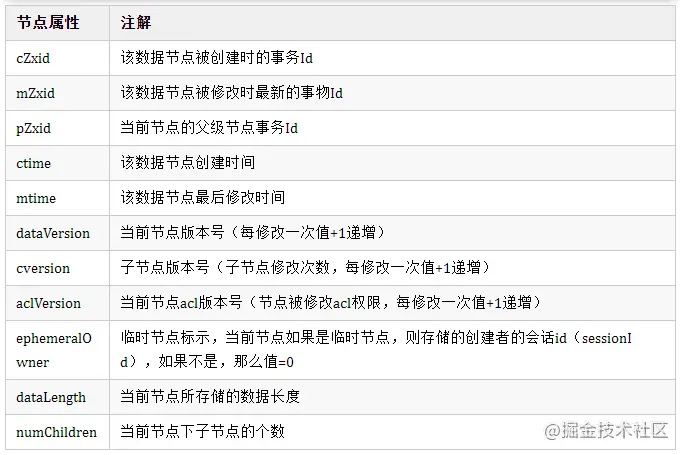
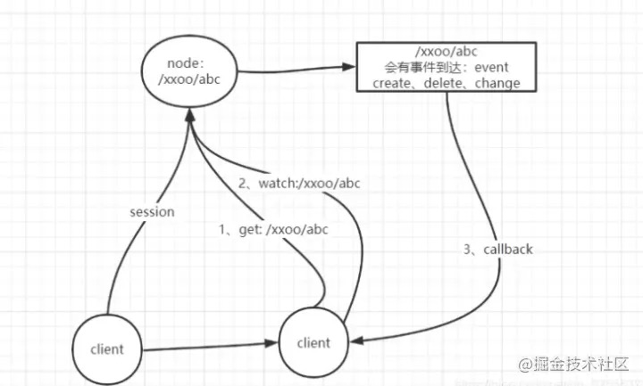
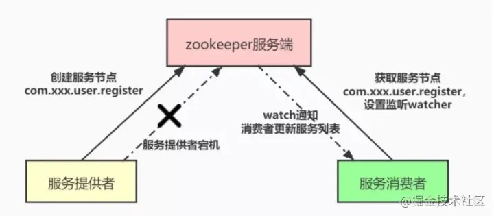
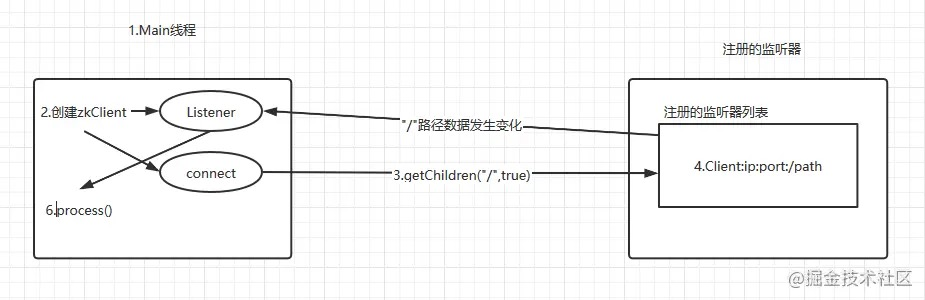

- [1、什么是Zookeeper](#1什么是zookeeper)
- [2、Zookeeper架构](#2zookeeper架构)
- [3、Zookeeer工作原理](#3zookeeer工作原理)
- [4、Zookeeper设计原理](#4zookeeper设计原理)
- [5、Zookeeper中的角色](#5zookeeper中的角色)
- [6、ZNode](#6znode)
- [7、Zookeeper的选主流程](#7zookeeper的选主流程)
- [8、watch机制](#8watch机制)
- [9、监听器的原理](#9监听器的原理)
- [10、Zookeeper应用场景](#10zookeeper应用场景)
  - [10.1 数据订阅发布](#101-数据订阅发布)
  - [10.2 命名服务](#102-命名服务)
  - [10.3 配置管理](#103-配置管理)
  - [10.4 集群管理](#104-集群管理)
  - [10.5 分布式通知协调](#105-分布式通知协调)
  - [10.6 分布式锁](#106-分布式锁)
  - [10.7 分布式队列](#107-分布式队列)

# 1、什么是Zookeeper
- Zookeeper是一个分布式、开元的分布式应用程序协调服务，是Google的Chubby的一个开元的实现，它是集群的管理者，监视着集群中各个节点的状态，根据节点提交的反馈进行下一步合理的操作。最终，将简单易用的接口和性能高效、功能稳定的系统提供给用户。
- Zookeeper一个最常用的场景就是作为服务提供者和消费者的注册中心，服务生产者将自己提供的服务注册到Zookeeper，服务消费者在进行服务调用时先到Zookeeper中查找服务，获取到服务生产者的信息之后在发起调用。
# 2、Zookeeper架构

ZooKeeper 的架构图中我们需要了解和掌握的主要有：
- Zookeeper作为Server和Client，客户端可以连接到整个Zookeeper服务的任意服务器上（除非leaderServer参数被显式设置，leader不允许接受客户端连接）
- 客户端使用并维护一个TCP连接，通过这个连接发送请求、接收响应、获取观察到的事件以及发送信息。如果这个TCP连接中断，客户端将自动尝试连接到别的Zookeeper服务器。客户端第一次连接到Zookeeper服务器时，可以接受这个连接的Zookeeper服务器为这个客户端建立一个会话。当这个客户端连接到别的服务器时，这个回话回呗新的服务器重新建立。
- 上图中的每个Server代表一个安装Zookeeper服务的机器，即是整个提供Zookeeper服务的集群（或者是伪集群）
- 组成Zookeeper服务的服务器必须彼此了解。它们维护一个内存中的状态图像，以及持久存储中的事务日志和快照，只要大多数服务可用，Zookeeper服务就可用。
- Zookeeper启动时，将从实例中选举一个leader，leader负责处理数据更新等操作，一个更新操作成功的标志是当且仅当大多数的Server在内存中成功修改数据。每个Server在内存中存储了一份数据。
- Zookeeper是可以集群复制的，及群众通过Zab协议（Zookeeper Atomic Broadcast）来保证数据一致性。
- Zab协议包含两个阶段：leader election阶段和Atomic Brodcast阶段。
  - 集群中将选举出一个leader，其他的机器则称为follower，所有的写操作都被传送给leader，并通过brodcast将所有的更新告诉给follower。
  - 当leader崩溃或者leader失去大多数的follower时，需要重新选举出一个新的leader，让所有的服务器都恢复到一个正确的状态。
  - 当leader被选举出来，且大多数服务器完成了 和leader的状态同步后，leadder election 的过程就结束了，就将会进入到Atomic brodcast的过程。
  - Atomic Brodcast同步leader和follower之间的信息，保证leader和follower具有形同的系统状态。
# 3、Zookeeer工作原理
- Zookeeper的核心是原子广播，这个机制保证了各个Server之间的同步。实现这个机制的协议叫做Zab协议。
- Zab协议有两种模式，它们 分别是恢复模式（选主）和广播模式（同步）。
- Zab协议 的全称是 **Zookeeper Atomic Broadcast** （Zookeeper原子广播）。Zookeeper 是通过 Zab 协议来保证分布式事务的最终一致性。Zab协议要求每个 Leader 都要经历三个阶段：发现，同步，广播。
- 当服务启动或者在领导者崩溃后，Zab就进入了恢复模式，当领导者被选举出来，且大多数Server完成了和 leader的状态同步以后，恢复模式就结束了。状态同步保证了leader和Server具有相同的系统状态。
- 为了保证事务的顺序一致性，zookeeper采用了递增的事务id号（zxid）来标识事务。所有的提议（proposal）都在被提出的时候加 上了zxid。实现中zxid是一个64位的数字，它高32位是epoch用来标识leader关系是否改变，每次一个leader被选出来，它都会有一 个新的epoch，标识当前属于那个leader的统治时期。第32位用于递增计数。
  - epoch：可以理解为皇帝的年号，当新的皇帝leader产生后，将有一个新的epoch年号。
- 每个Server在工作过程中有三种状态：
  - LOOKING：当前Server不知道leader是谁，正在搜寻。
  - LEADING：当前Server即为选举出来的leader。
  - FOLLOWING：leader已经选举出来，当前Server与之同步。
# 4、Zookeeper设计原理
ZooKeeper设计的目的是提供高性能、高可用、顺序一致性的分布式协调服务、保证数据最终一致性。
- 高性能（简单的数据模型）
  - 采用树形结构组织数据节点
  - 全量数据节点，都存储在内存中
  - Follower 和 Observer 直接处理非事务请求
- 高可用（构建集群）
  - 半数以上机器存活，服务就能正常运行
  - 自动进行 Leader 选举
- 顺序一致性（事务操作的顺序）
  - 每个事务请求，都会转发给 Leader 处理
  - 每个事务，会分配全局唯一的递增id（zxid，64位：epoch + 自增 id）
- 最终一致性
  - 通过提议投票方式，保证事务提交的可靠性
  - 提议投票方式，只能保证 Client 收到事务提交成功后，半数以上节点能够看到最新数据
# 5、Zookeeper中的角色
- leader
  - Leader服务器为客户端提供读服务和写服务。负责进行投票的发起和决议，更新系统状态。
- follower
  - Follower服务器为客户端提供读服务，参与Leader选举过程，参与写操作“过半写成功”策略。
- observer
  - Observer服务器为客户端提供读服务，不参与Leader选举过程，不参与写操作“过半写成功”策略。用于在不影响写性能的前提下提升集群的读性能。
- client
  - 服务请求发起方。
# 6、ZNode
- Znode两种类型：
  - 持久的（persistent）：客户端和服务器端断开连接后，创建的节点不删除（默认）。
  - 短暂的（ephemeral）：客户端和服务器端断开连接后，创建的节点自己删除。
- Znode有四种形式：
  - 持久化目录节点（PERSISTENT）：客户端与Zookeeper断开连接后，该节点依旧存在持久化顺序编号目录节点（PERSISTENT_SEQUENTIAL）
  - 客户端与Zookeeper断开连接后，该节点依旧存在，只是Zookeeper给该节点名称进行顺序编号：临时目录节点（EPHEMERAL）
  - 客户端与Zookeeper断开连接后，该节点被删除：临时顺序编号目录节点（EPHEMERAL_SEQUENTIAL）
  - 客户端与Zookeeper断开连接后，该节点被删除，只是Zookeeper给该节点名称进行顺序编号

# 7、Zookeeper的选主流程
出现选举主要是两种场景：初始化、leader不可用。当zk集群中的一台服务器出现这两种情况之一时，就会开始leader选举。而当一台机器进入leader选举流程时，当前集群也可能处于以下两种状态：
  - 集群中本来就已经存在一个leader。
  - 集群中确实不存在leader。

首先第一种情况，通常是集群中某一台机器启动比较晚，在它启动之前，集群已经正常工作，即已经存在一台leader服务器。当该机器试图去选举leader时，会被告知当前服务器的leader信息，它仅仅需要和leader机器建立连接，并进行状态同步即可。

投票信息中包含两个最基本的信息：
- sid：即server id，用来标识该机器在集群中的机器序号。
- zxid：即zookeeper事务id号。

      ZooKeeper状态的每一次改变, 都对应着一个递增的Transaction id,，该id称为zxid.，由于zxid的递增性质, 如果zxid1小于zxid2,，那么zxid1肯定先于zxid2发生。创建任意节点，或者更新任意节点的数据， 或者删除任意节点，都会导致Zookeeper状态发生改变，从而导致zxid的值增加。

      以（sid，zxid）的形式来标识一次投票信息。

      例如：如果当前服务器要推举sid为1，zxid为8的服务器称为leader，那么投票信息可以表示为（1，8）

      集群中的每台机器发出自己的投票后，也会接受来自集群中其他机器的投票。每台机器都会根据一定的规则，来处理收到的其他机器的投票，以此来决定是否需要变更自己的投票。
- 规则如下：
  - （1）初始阶段，都会给自己投票。
  - （2）当接收到来自其他服务器的投票时，都需要将别人的投票和自己的投票进行pk，规则如下：
    - 优先检查zxid。zxid比较大的服务器优先作为leader。如果zxid相同的话，就比较sid，sid比较大的服务器作为leader。
# 8、watch机制
client端会对某个znode 注册一个watcher事件，当该znode发生变化时，这些client会收到ZooKeeper的通知，然后client可以根据znode变化来做出业务上的改变等。

zookeeper为dubbo提供服务的注册与发现，作为注册中心，zookeeper为啥能够实现服务的注册与发现？

**Watcher（监听者）**

watcher 是zooKeeper中一个非常核心功能 ，客户端watcher 可以监控节点的数据变化以及它子节点的变化，一旦这些状态发生变化，zooKeeper服务端就会通知所有在这个节点上设置过watcher的客户端 ，从而每个客户端都很快感知，它所监听的节点状态发生变化，而做出对应的逻辑处理。

zookeeper是如何实现服务的注册与发现。zookeeper的服务注册与发现，主要应用的是zookeeper的znode节点数据模型和watcher机制，大致的流程如下：

- 服务注册：服务提供者（Provider）启动时，会向zookeeper服务端注册服务信息，也就是创建一个节点，例如：用户注册服务com.xxx.user.register，并在节点上存储服务的相关数据（如服务提供者的ip地址、端口等）。
- 服务发现：服务消费者（Consumer）启动时，根据自身配置的依赖服务信息，向zookeeper服务端获取注册的服务信息并设置watch监听，获取到注册的服务信息之后，将服务提供者的信息缓存在本地，并进行服务的调用。
- 服务通知：一旦服务提供者因某种原因宕机不再提供服务之后，客户端与zookeeper服务端断开连接，zookeeper服务端上服务提供者对应服务节点会被删除（例如：用户注册服务com.xxx.user.register），随后zookeeper服务端会异步向所有消费用户注册服务com.xxx.user.register，且设置了watch监听的服务消费者发出节点被删除的通知，消费者根据收到的通知拉取最新服务列表，更新本地缓存的服务列表。

**Watcher有哪些类型？**

znode节点可以设置两类watch：
  - 一种是DataWatches，基于znode节点的数据变更从而触发 watch 事件，触发条件getData()、exists()、setData()、 create()。
  - 另一种是Child Watches，基于znode的孩子节点发生变更触发的watch事件，触发条件 getChildren()、 create()。

而在调用 delete() 方法删除znode时，则会同时触发Data Watches和Child Watches，如果被删除的节点还有父节点，则父节点会触发一个Child Watches。

watch对节点的监听事件是一次性的！客户端在指定的节点设置了监听watch，一旦该节点数据发生变更通知一次客户端后，客户端对该节点的监听事件就失效了。

如果还要继续监听这个节点，就需要我们在客户端的监听回调中，再次对节点的监听watch事件设置为True。否则客户端只能接收到一次该节点的变更通知。
# 9、监听器的原理

- 创建一个Main()线程。
- 在Main()线程中创建两个线程，一个负责网络连接通信（connect），一个负责监听（listener）。
- 通过connect线程将注册的监听事件发送给Zookeeper。
- 将注册的监听事件添加到Zookeeper的注册监听器列表中。
- Zookeeper监听到有数据或路径发生变化时，把这条消息发送给Listener线程。
- Listener线程内部调用process()方法。
# 10、Zookeeper应用场景
## 10.1 数据订阅发布
发布与订阅即所谓的配置管理，顾名思义就是将数据发布到ZooKeeper节点上，供订阅者动态获取数据，实现配置信息的集中式管理和动态更新。例如全局的配置信息，地址列表等就非常适合使用。

数据发布/订阅的一个常见的场景是配置中心，发布者把数据发布到 ZooKeeper 的一个或一系列的节点上，供订阅者进行数据订阅，达到动态获取数据的目的。

ZooKeeper 采用的是推拉结合的方式。
- 推: 服务端会推给注册了监控节点的客户端 Wathcer 事件通知
- 拉: 客户端获得通知后，然后主动到服务端拉取最新的数据

## 10.2 命名服务
作为分布式命名服务，命名服务是指通过指定的名字来获取资源或者服务的地址，利用ZooKeeper创建一个全局的路径，这个路径就可以作为一个名字，指向集群中的集群，提供的服务的地址，或者一个远程的对象等等。
- 1、在分布式环境下，经常需要对应用/服务进行统一命名，便于识别不同服务。
  - 类似于域名与IP之间对应关系，IP不容易记住，而域名容易记住。
  - 通过名称来获取资源或服务的地址，提供者等信息。
- 2、按照层次结构组织服务/应用名称。
  - 可将服务名称以及地址信息写到ZooKeeper上，客户端通过ZooKeeper获取可用服务列表类。

## 10.3 配置管理
程序分布式的部署在不同的机器上，将程序的配置信息放在ZooKeeper的znode下，当有配置发生改变时，也就是znode发生变化时，可以通过改变zk中某个目录节点的内容，利用watch通知给各个客户端 从而更改配置。
- 1、分布式环境下，配置文件管理和同步是一个常见问题。
  - 一个集群中，所有节点的配置信息是一致的，比如 Hadoop 集群。
  - 对配置文件修改后，希望能够快速同步到各个节点上。
- 2、配置管理可交由ZooKeeper实现。
  - 可将配置信息写入ZooKeeper上的一个Znode。
  - 各个节点监听这个Znode。
  - 一旦Znode中的数据被修改，ZooKeeper将通知各个节点。
## 10.4 集群管理
所谓集群管理就是：是否有机器退出和加入、选举master。

集群管理主要指集群监控和集群控制两个方面。前者侧重于集群运行时的状态的收集，后者则是对集群进行操作与控制。
- 1、分布式环境中，实时掌握每个节点的状态是必要的，可根据节点实时状态做出一些调整。
- 2、可交由ZooKeeper实现。
  - 可将节点信息写入ZooKeeper上的一个Znode。
  - 监听这个Znode可获取它的实时状态变化。
- 3、典型应用
  - Hbase中Master状态监控与选举。
  - 利用ZooKeeper的强一致性，能够保证在分布式高并发情况下节点创建的全局唯一性，即：同时有多个客户端请求创建 /currentMaster 节点，最终一定只有一个客户端请求能够创建成功

## 10.5 分布式通知协调
- 1、分布式环境中，经常存在一个服务需要知道它所管理的子服务的状态。
  - a）NameNode需知道各个Datanode的状态。
  - b）JobTracker需知道各个TaskTracker的状态。
- 2、心跳检测机制可通过ZooKeeper来实现。
- 3、信息推送可由ZooKeeper来实现，ZooKeeper相当于一个发布/订阅系统。
## 10.6 分布式锁
处于不同节点上不同的服务，它们可能需要顺序地访问一些资源，这里需要一把分布式的锁。

分布式锁具有以下特性：写锁、读锁、时序锁。
- 写锁：在zk上创建的一个临时的无编号的节点。由于是无序编号，在创建时不会自动编号，导致只能客户端有一个客户端得到锁，然后进行写入。
- 读锁：在zk上创建一个临时的有编号的节点，这样即使下次有客户端加入是同时创建相同的节点时，他也会自动编号，也可以获得锁对象，然后对其进行读取。
- 时序锁：在zk上创建的一个临时的有编号的节点根据编号的大小控制锁。

## 10.7 分布式队列
分布式队列分为两种：
- 1、当一个队列的成员都聚齐时，这个队列才可用，否则一直等待所有成员到达，这种是同步队列。
  - a）一个job由多个task组成，只有所有任务完成后，job才运行完成。
  - b）可为job创建一个/job目录，然后在该目录下，为每个完成的task创建一个临时的Znode，一旦临时节点数目达到task总数，则表明job运行完成。
- 2、队列按照FIFO方式进行入队和出队操作，例如实现生产者和消费者模型。