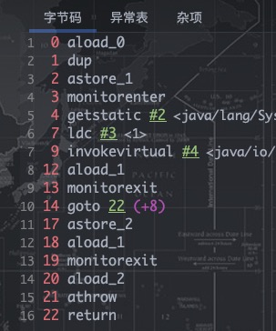

- [1、Synchronized的使用](#1synchronized的使用)
  - [1.1 对象锁](#11-对象锁)
  - [1.2 类锁](#12-类锁)
- [2、Synchronized原理分析](#2synchronized原理分析)
  - [2.1 可重入原理](#21-可重入原理)
  - [2.2 保证可见性的原理：内存模型和happens-before规则](#22-保证可见性的原理内存模型和happens-before规则)
- [3、JVM中锁的优化](#3jvm中锁的优化)
  - [3.1 锁的类型](#31-锁的类型)
    - [3.1.1 自旋锁与自适应自旋锁](#311-自旋锁与自适应自旋锁)
    - [3.1.2 锁消除](#312-锁消除)
    - [3.1.3 锁粗化](#313-锁粗化)
    - [3.1.4 轻量级锁](#314-轻量级锁)
    - [3.1.5 偏向锁](#315-偏向锁)
- [4、Synchronized与Lock](#4synchronized与lock)
# 1、Synchronized的使用
- 一把锁只能同时被一个线程获取，没有获得锁的线程只能等待；
每个实例都对应有自己的一把锁(this),不同实例之间互不影响；例外：锁对象是*.class以及synchronized修饰的是static方法的时候，所有对象公用同一把锁
- synchronized修饰的方法，无论方法正常执行完毕还是抛出异常，都会释放锁
## 1.1 对象锁
包括方法锁(默认锁对象为this,当前实例对象)和同步代码块锁(自己指定锁对象)
- 代码块形式：手动指定锁定对象，也可是是this,也可以是自定义的锁
- 方法锁形式：synchronized修饰普通方法，锁对象默认为this
## 1.2 类锁
指synchronize修饰静态的方法或指定锁对象为Class对象
# 2、Synchronized原理分析

现象、时机(内置锁this)、深入JVM看字节码(反编译看monitor指令)
- monitorenter：monitor计数器 + 1，可重入
- monitorexit：monitor计数器 - 1，为0时释放锁
同步队列SynchronizedQueue
## 2.1 可重入原理
    执行静态同步方法的时候就只有一条monitorexit指令，并没有monitorenter获取锁的指令。这就是锁的重入性，即在同一锁程中，线程不需要再次获取同一把锁。Synchronized先天具有重入性。每个对象拥有一个计数器，当线程获取该对象锁后，计数器就会加一，释放锁后就会将计数器减一。
## 2.2 保证可见性的原理：内存模型和happens-before规则

    根据happens-before的定义中的一条:如果A happens-before B，则A的执行结果对B可见，并且A的执行顺序先于B。线程A先对共享变量A进行加一，由2 happens-before 5关系可知线程A的执行结果对线程B可见即线程B所读取到的a的值为1。 
# 3、JVM中锁的优化
- Synchronized的锁依赖OS的mutex函数进行加锁，mutex函数会将线程挂起，并从用户态切换至内核态。在现实中的大部分情况下，同步方法是运行在单线程环境(无锁竞争环境)如果每次都调用Mutex Lock那么将严重的影响程序的性能。
- 在jdk1.6中对锁的实现引入了大量的优化，如锁粗化(Lock Coarsening)、锁消除(Lock Elimination)、轻量级锁(Lightweight Locking)、偏向锁(Biased Locking)、适应性自旋(Adaptive Spinning)等技术来减少锁操作的开销。
  - 锁粗化：也就是减少不必要的紧连在一起的unlock，lock操作，将多个连续的锁扩展成一个范围更大的锁。
  - 锁消除：通过运行时JIT编译器的逃逸分析来消除一些没有在当前同步块以外被其他线程共享的数据的锁保护，通过逃逸分析也可以在线程本地Stack上进行对象空间的分配(同时还可以减少Heap上的垃圾收集开销)。
  - 轻量级锁：这种锁实现的背后基于这样一种假设，即在真实的情况下我们程序中的大部分同步代码一般都处于无锁竞争状态(即单线程执行环境)，在无锁竞争的情况下完全可以避免调用操作系统层面的重量级互斥锁，取而代之的是在monitorenter和monitorexit中只需要依靠一条CAS原子指令就可以完成锁的获取及释放。当存在锁竞争的情况下，执行CAS指令失败的线程将调用操作系统互斥锁进入到阻塞状态，当锁被释放的时候被唤醒。
  - 偏向锁：是为了在无锁竞争的情况下避免在锁获取过程中执行不必要的CAS原子指令，因为CAS原子指令虽然相对于重量级锁来说开销比较小但还是存在非常可观的本地延迟。
  - 适应性自旋：当线程在获取轻量级锁的过程中执行CAS操作失败时，在进入与monitor相关联的操作系统重量级锁(mutex semaphore)前会进入忙等待(Spinning)然后再次尝试，当尝试一定的次数后如果仍然没有成功则调用与该monitor关联的semaphore(即互斥锁)进入到阻塞状态。
## 3.1 锁的类型
- 在Java SE 1.6里Synchronied同步锁，一共有四种状态：无锁、偏向锁、轻量级所、重量级锁，它会随着竞争情况逐渐升级。锁可以升级但是不可以降级，目的是为了提供获取锁和释放锁的效率。
- 锁膨胀：无锁 → 偏向锁 → 轻量级锁 → 重量级锁 (此过程是不可逆的)
### 3.1.1 自旋锁与自适应自旋锁
- 自旋锁

    在没有加入锁优化时，Synchronized是一个非常“胖大”的家伙。在多线程竞争锁时，当一个线程获取锁时，它会阻塞所有正在竞争的线程，这样对性能带来了极大的影响。在挂起线程和恢复线程的操作都需要转入内核态中完成，这些操作对系统的并发性能带来了很大的压力。同时HotSpot团队注意到在很多情况下，共享数据的锁定状态只会持续很短的一段时间，为了这段时间去挂起和回复阻塞线程并不值得。在如今多处理器环境下，完全可以让另一个没有获取到锁的线程在门外等待一会(自旋)，但不放弃CPU的执行时间。等待持有锁的线程是否很快就会释放锁。为了让线程等待，我们只需要让线程执行一个忙循环(自旋)，这便是自旋锁由来的原因。

        在JDK定义中，自旋锁默认的自旋次数为10次，用户可以使用参数-XX:PreBlockSpin来更改。
- 自适应自旋锁

    在JDK 1.6中引入了自适应自旋锁。这就意味着自旋的时间不再固定了，而是由前一次在同一个锁上的自旋 时间及锁的拥有者的状态来决定的。如果在同一个锁对象上，自旋等待刚刚成功获取过锁，并且持有锁的线程正在运行中，那么JVM会认为该锁自旋获取到锁的可能性很大，会自动增加等待时间。比如增加到100此循环。相反，如果对于某个锁，自旋很少成功获取锁。那再以后要获取这个锁时将可能省略掉自旋过程，以避免浪费处理器资源。有了自适应自旋，JVM对程序的锁的状态预测会越来越准备，JVM也会越来越聪明。
### 3.1.2 锁消除
- 锁消除时指虚拟机即时编译器再运行时，对一些代码上要求同步，但是被检测到不可能存在共享数据竞争的锁进行消除。锁消除的主要判定依据来源于逃逸分析的数据支持。意思就是：JVM会判断再一段程序中的同步明显不会逃逸出去从而被其他线程访问到，那JVM就把它们当作栈上数据对待，认为这些数据时线程独有的，不需要加同步。此时就会进行锁消除。
### 3.1.3 锁粗化
- 加同步锁时，尽可能的将同步块的作用范围限制到尽量小的范围(只在共享数据的实际作用域中才进行同步，这样是为了使得需要同步的操作数量尽可能变小。在存在锁同步竞争中，也可以使得等待锁的线程尽早的拿到锁)。但是如果存在连串的一系列操作都对同一个对象反复加锁和解锁，甚至加锁操作时出现在循环体中的，那即使没有线程竞争，频繁地进行互斥同步操作也会导致不必要地性能操作。
### 3.1.4 轻量级锁
- 大多数情况下同步块并不会有竞争出现提出的一种优化。它可以减少重量级锁对线程的阻塞带来地线程开销。从而提高并发性能。
- 在对象头中(Object Header)存在两部分。第一部分用于存储对象自身的运行时数据，HashCode、GC Age、锁标记位、是否为偏向锁。等。一般为32位或者64位(视操作系统位数定)。官方称之为Mark Word，它是实现轻量级锁和偏向锁的关键。 另外一部分存储的是指向方法区对象类型数据的指针(Klass Point)，如果对象是数组的话，还会有一个额外的部分用于存储数据的长度。

### 3.1.5 偏向锁
- 在大多实际环境下，锁不仅不存在多线程竞争，而且总是由同一个线程多次获取，那么在同一个线程反复获取所释放锁中，其中并还没有锁的竞争，那么这样看上去，多次的获取锁和释放锁带来了很多不必要的性能开销和上下文切换。
- 偏向锁使用了一种等待竞争出现才会释放锁的机制。所以当其他线程尝试获取偏向锁时，持有偏向锁的线程才会释放锁。但是偏向锁的撤销需要等到全局安全点Safe Point(就是当前线程没有正在执行的字节码)。它会首先暂停拥有偏向锁的线程，让你后检查持有偏向锁的线程是否活着。如果线程不处于活动状态，直接将对象头设置为无锁状态。如果线程活着，JVM会遍历栈帧中的锁记录，栈帧中的锁记录和对象头要么偏向于其他线程，要么恢复到无锁状态或者标记对象不适合作为偏向锁。 
# 4、Synchronized与Lock
- synchronized的缺陷：
  - 效率低：锁的释放情况少，只有代码执行完毕或者异常结束才会释放锁；试图获取锁的时候不能设定超时，不能中断一个正在使用锁的线程，相对而言，Lock可以中断和设置超时。
  - 不够灵活：加锁和释放的时机单一，每个锁仅有一个单一的条件(某个对象)，相对而言，读写锁更加灵活。
  - 无法知道是否成功获得锁，相对而言，Lock可以拿到状态，如果成功获取锁，....，如果获取失败，.....。
- Lock解决相应问题：
  - lock(): 加锁
  - unlock(): 解锁
  - tryLock(): 尝试获取锁，返回一个boolean值
  - tryLock(long,TimeUtil): 尝试获取锁，可以设置超时
  
        多线程竞争一个锁时，其余未得到锁的线程只能不停的尝试获得锁，而不能中断。高并发的情况下会导致性能下降。ReentrantLock的lockInterruptibly()方法可以优先考虑响应中断。 一个线程等待时间过长，它可以中断自己，然后ReentrantLock响应这个中断，不再让这个线程继续等待。有了这个机制，使用ReentrantLock时就不会像synchronized那样产生死锁了。 
- 使用Synchronized有哪些要注意的？
  - 锁对象不能为空，因为锁的信息都保存在对象头里
  - 作用域不宜过大，影响程序执行的速度，控制范围过大，编写代码也容易出错
  - 避免死锁
  - 在能选择的情况下，既不要用Lock也不要用Synchronized关键字，用java.util.concurrent包中的各种各样的类，如果不用该包下的类，在满足业务的情况下，可以使用synchronized关键，因为代码量少，避免出错 
  - synchronized实际上是非公平的，新来的线程有可能立即获得监视器，而在等待区中等候已久的线程可能再次等待，不过这种抢占的方式可以预防饥饿。

