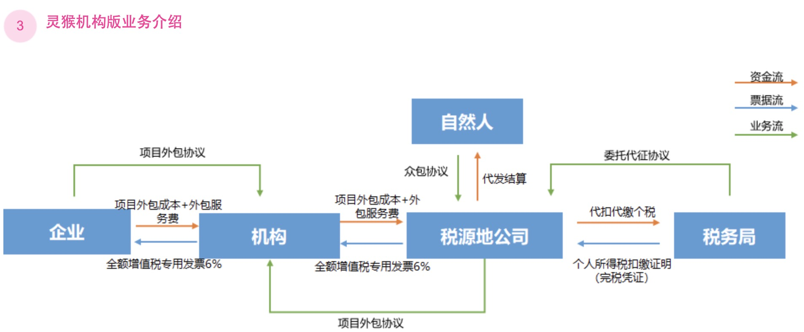
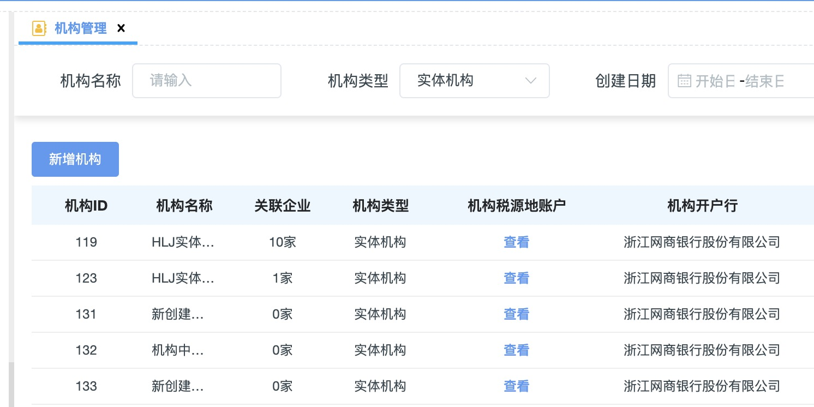
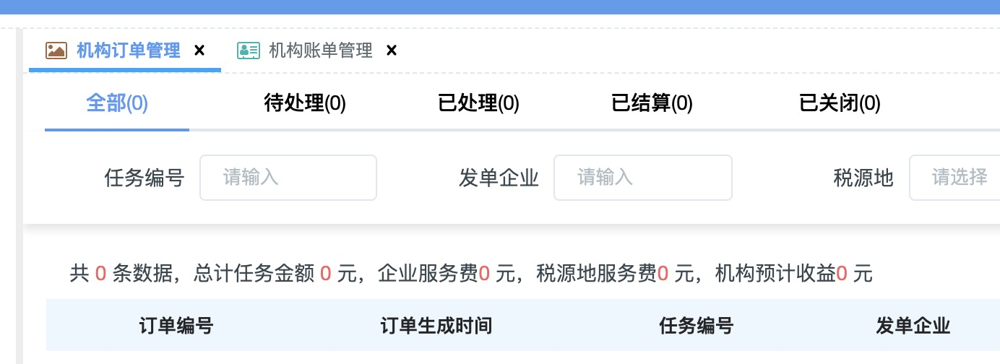

- [灵猴账户体系](#灵猴账户体系)
  - [1、企业账户](#1企业账户)
    - [1.1、相关数据库表：](#11相关数据库表)
    - [1.2、开户流程](#12开户流程)
    - [1.3、账户展示](#13账户展示)
  - [2、机构账户（灵猴机构版）](#2机构账户灵猴机构版)
  - [3、税源地（服务商）账户](#3税源地服务商账户)
- [完毕](#完毕)
# 灵猴账户体系
## 1、企业账户
***
- 企业税源地账户
- 企业机构账户（灵猴机构版）

        只有实体机构才会开通此账户
    

        企业只能开通这里支持的类型的账户，这种类型的企业没有落地城市
- 企业服务费账户

根据这个条件来判断是否需要开通服务费账户
### 1.1、相关数据库表：
- company（企业表）
- company_account_type（企业账户表）
- ralph_tax_area（税源地表）
- ralph_tax_area_detail（税源地详情表）
***
- company_organization_channel(机构渠道关系映射表)
    
        开通机构账户需要用到这张表
***
<!-- 有活包包新增company_signed_area表（企业签约表） -->
### 1.2、开户流程
- 1、校验
  - 企业是否存在
  - 企业配置是否存在
  - 企业配置表的账户类型(40、60、70···)是否存在
  - ···
- 2、开户
  - 主要参数（需要base提前提供）：
    - 企业税源地账户
      - ac_tax_area_id 账户中心落地城市id（ralph_tax_area）
      - ac_channel_id 账户中心渠道id（ralph_tax_area_detail）
    - 企业机构账户
      - ac_company_org_id 账户中心机构id
      - ac_channel_id 账户中心渠道id
         
            都在company_organization_channel表
    - 企业服务费账户：取Apollo配置直接开就完事了
### 1.3、账户展示

## 2、机构账户（灵猴机构版）
***
灵猴机构版业务介绍：

***
**与企业开通账户流程差不多，在这里查看账户**

**实体机构登录可以查看这里的数据**

## 3、税源地（服务商）账户
***
最初用在有活包包端，那时候还叫saas系统，由机构自己去创建园区，提前在base维护好数据，创建时可以同步

**这里同步账户其实就相当于给ralph_tax_area_detail表添加了一条数据，用于企业在开户时使用，无其他用途场景。**

# 完毕
