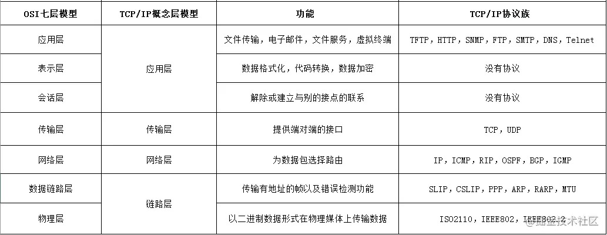
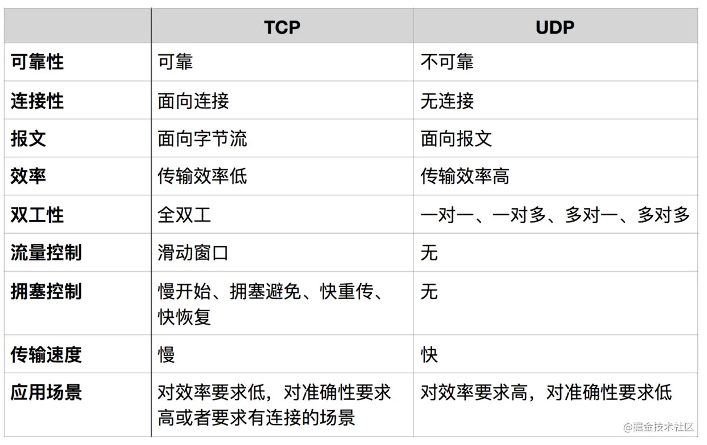

# 1、OSI七层模型
- TCP/IP协议模型（Transmission Control Protocol/Internet Protocol），包含了一系列构成互联网基础的网络协议，是Internet的核心协议。
- 基于TCP/IP的参考模型将协议分成四个层次，它们分别是链路层、网络层、传输层和应用层。下图表示TCP/IP模型与OSI模型各层的对照关系。

TCP/IP协议族按照层次由上到下，层层包装：
- 最上面的是应用层，这里面有http，ftp,等等我们熟悉的协议。
- 而第二层则是传输层，著名的TCP和UDP协议就在这个层次。
- 第三层是网络层，IP协议就在这里，它负责对数据加上IP地址和其他的数据以确定传输的目标。
- 第四层是数据链路层，这个层次为待传送的数据加入一个以太网协议头，并进行CRC编码，为最后的数据传输做准备。
# 2、TCP / UDP
TCP/UDP都是是传输层协议，但是两者具有不同的特性，同时也具有不同的应用场景，下面以图表的形式对比分析。
